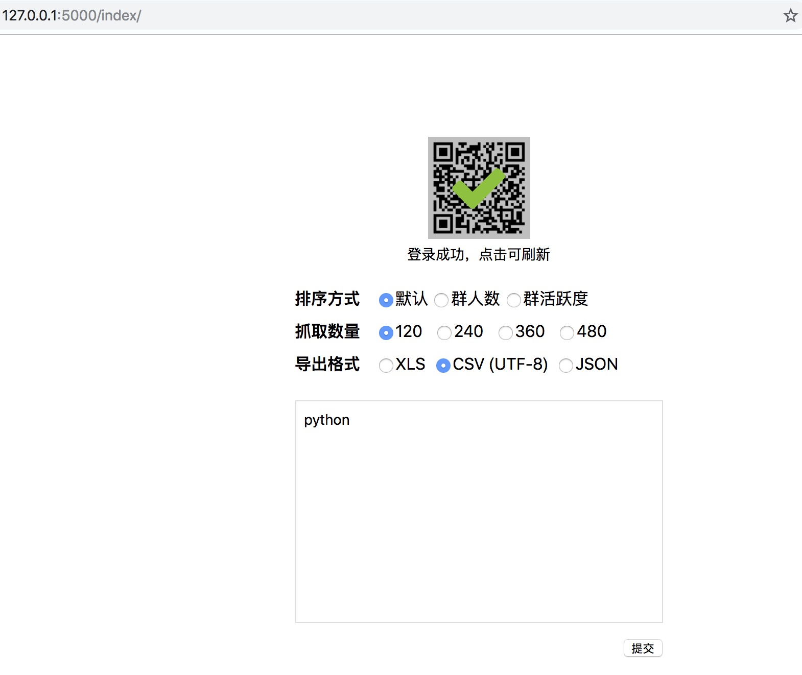
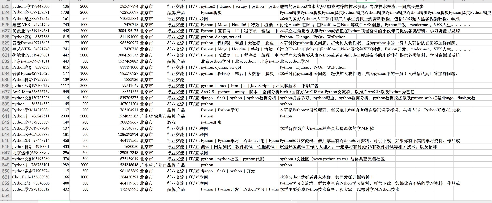

# 基于flask QQ群信息爬虫
功能：
* [x] web客户端
* [x] 内存中处理数据(提取，压缩)




### 环境依赖：
```pyton
Flask==0.12.1
pyexcel==0.5.9.1
Flask_Migrate==2.0.3
Flask_Script==2.0.6
requests==2.19.1

```

### 使用说明
* pip3 install -r requirements.txt 安装所需包


### 运行程序
```bash
python manage.py runserver
```

